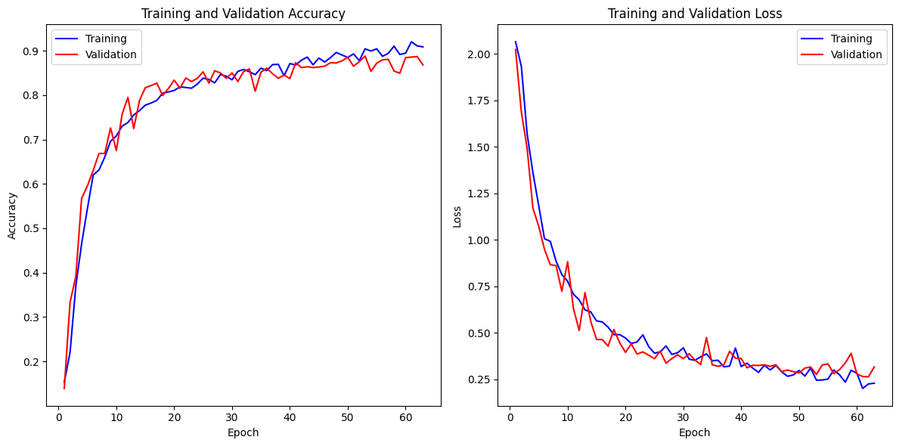
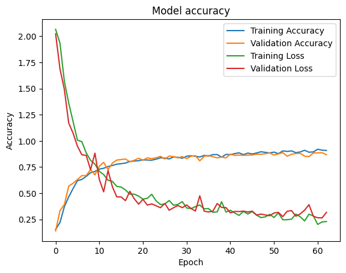
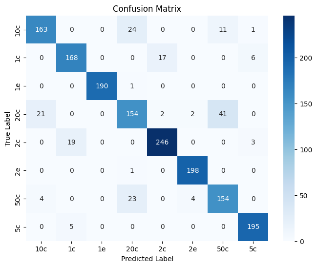
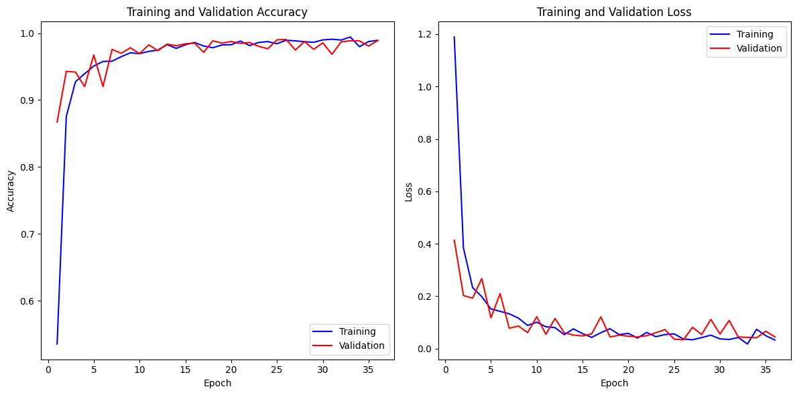
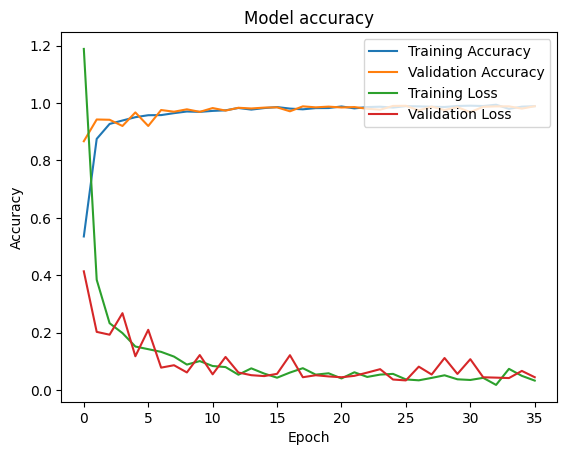
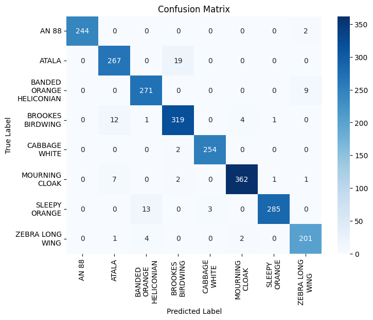
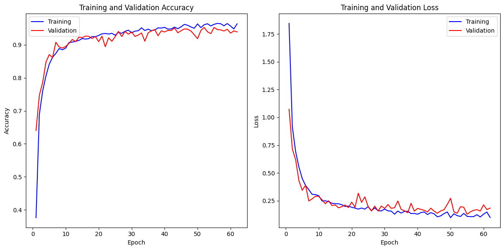
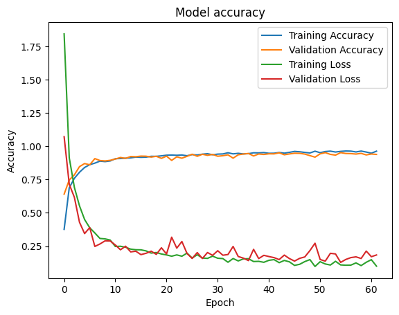
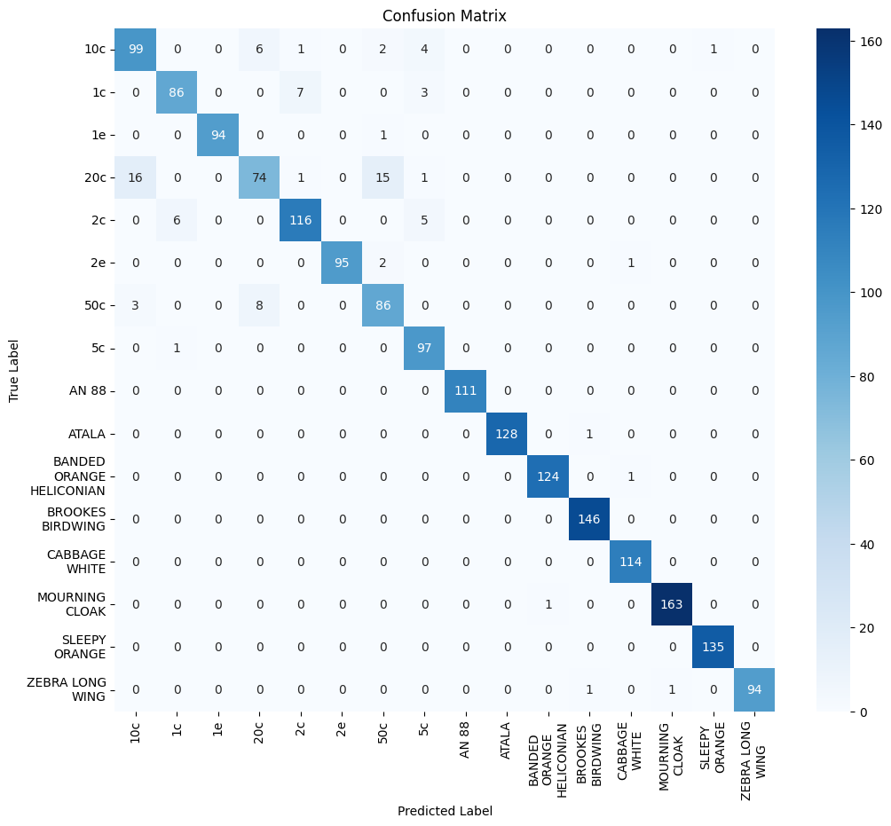

# FSI Practice 2: Neural Network Image Classification 

## 📋 Overview
This project involves the development of a neural network to classify a collection of images. Students have the flexibility to create their own dataset by capturing photos of different objects under varying locations and conditions. Example categories include books, kitchen utensils, coins, clothing items, toilet rolls, etc. The recommended number of distinct classes ranges from 4 to 7, with each class containing at least 20 images for training and 5 for validation.

## 🎯 Objective
The main goal is to train a neural network and graphically visualize the accuracy progress for both training and validation datasets. This process utilizes the `history` object returned by the `fit` method of the model. Additionally, the project explores:

- Data augmentation on the training set.
- Testing various hyperparameter configurations to determine the optimal setup.
- Understanding the workings and rationale behind the categorical cross-entropy loss function.

Por supuesto, aquí tienes el texto actualizado en inglés:

## 🚀 Getting Started
To begin working with this project, ensure you have the required Python libraries installed, including TensorFlow, Keras, and relevant data processing libraries. Refer to the provided Jupyter notebooks for detailed implementation and further instructions on training the models with the datasets.

## 📊 Datasets
The practice was conducted with two distinct datasets: one consisting of Butterfly and Moth species, and another comprising Euro coins. Below are the categories for each dataset:

### 🦋 Butterfly and Moth Categories:
- AN 88
- ATALA
- BANDED ORANGE HELICONIAN
- BROOKES BIRDWING
- CABBAGE WHITE
- MOURNING CLOAK
- SLEEPY ORANGE
- ZEBRA LONG WING

### 💰 Euro Coin Categories:
- 1 cent
- 2 cents
- 5 cents
- 10 cents
- 20 cents
- 50 cents
- 1 euro
- 2 euros

The datasets used in this project were obtained from external sources and underwent certain modifications to adapt them to the project's requirements. Below, we describe the origin and modifications made to each of them:

- **Butterfly and Moth Categories:** This dataset was obtained from Kaggle through the following link: [Butterfly Images (40 Species)](https://www.kaggle.com/datasets/gpiosenka/butterfly-images40-species). Although the original dataset contained images of 100 different species of butterflies and moths, specifically 8 of these species were selected for classification in this project. This selection was made to reduce the complexity of the model and focus on a more manageable set of categories.

- **Euro Coin Categories:** The dataset was obtained from Roboflow through the following link: [Coin Detection Dataset](https://universe.roboflow.com/coindetection/coin-detection-fo8ol/dataset/11). Modifications were made to this dataset, including the addition of custom images and the removal of some images that were not suitable for the neural network. Additionally, a data cleaning and improvement process was carried out to ensure the quality of the images used in training.

These datasets were selected and adapted to meet the project's requirements and to ensure data quality and suitability for image classification.

If you would like to get more details about the structure and content of each dataset, you can access the provided links to review the original information.

## 💻 Implementation
Throughout the project, various techniques and strategies in neural network construction and optimization are employed. The use of Keras and TensorFlow frameworks facilitates the model-building process. Early stopping is one such strategy to prevent overfitting and to ensure the model generalizes well to unseen data.

### 🏗️ Model Architecture
The neural networks developed for this project is a convolutional neural network (CNN) using TensorFlow and Keras. The model architecture includes:
- **Convolutional Layers**: To extract features from the images.
- **Pooling Layers**: To reduce the dimensionality of the feature maps.
- **Fully Connected Layers**: To interpret the features extracted by the convolutional and pooling layers.

### 🔄 Data Preprocessing
- **Data Loading**: The images are loaded into the model using Keras' `image_dataset_from_directory` function.
- **Data Augmentation**: To increase the diversity of the dataset, augmentations like rotation, zoom, and flip are applied.

### 🔧 Model Compilation
- **Optimizer**: Adam optimizer with a learning rate of 1e-3.
- **Loss Function**: Categorical cross-entropy, suitable for multi-class classification.

### 🏋️ Model Training
- **Early Stopping**: Implemented to prevent overfitting by monitoring the validation accuracy.
- **Epochs**: The model is trained for a specific number of epochs, with early stopping dictating the actual number of epochs executed based on model performance.

### 📊 Performance Evaluation
- **Metrics**: Accuracy, precision, recall, and F1-score are used to evaluate the model.
- **Visualization**: Confusion matrices and performance graphs are generated to visually represent the model’s performance.

### 🔍 Specific Model Details
- **Global Average Pooling**: Applied after the feature extraction layers to reduce the feature map size.
- **Dense Layer**: A fully connected layer with 256 neurons and ReLU activation.

## 📈 Results and outcomes

### 💰 Euro-Coin Classifier Charts

The model's performance, as visualized in the graphs, indicates a successful training process. The first graph displays the training and validation accuracy over epochs, showing that the model achieves high accuracy on both the training and validation sets, with a convergence indicating good generalization. The accuracy stabilizes above 80%, suggesting that the model has learned to classify the coin images effectively.

### 💰 Euro-Coin Classifier Confusion-Matrix

The confusion matrix for the EuroCoinClassifier indicates high predictive accuracy, particularly with 1 euro, 2 euro and 5 cents coins, demonstrating the model's robustness. 

However, some confusion is observed between coins of similar sizes, such as 20 cents being occasionally misclassified as 50 cents and 10 cents. The 10 cents denomination also shows notable confusion with the 50 cent and 20 cent coins. 

These insights point to a need for further fine-tuning, possibly by improving feature extraction and dataset image resolution to better distinguish between coins with subtle differences.

Overall, the model's performance is promising, showcasing its potential for accurate real-world application in coin recognition tasks.

### 🦋 Butterfly and Moth Classifier Charts

### 🦋 Butterfly and Moth Classifier Confusion-Matrix

The primary diagonal entries represent the number of correct predictions for each class, indicating strong performance for classes like 'AN 88', 'ATALA', and 'MOURNING CLOAK', where the model predictions align well with the actual labels. 

Misclassifications are minimal, with only a few instances where the model confuses one class for another, such as a few cases of 'MOURNING CLOAK' being classified as 'ATALA' or 'SLEEPY ORANGE' being mistaken for 'ZEBRA LONG WING'. 

Overall, the model demonstrates a high degree of accuracy, but the slight misclassifications provide opportunities for further fine-tuning.

### 🦋💰 Combined Butterfly-Moth and Euro-Coin Classifier Charts 

### 🦋💰 Combined Butterfly-Moth and Euro-Coin Classifier Confusion-Matrix

## 🛠️ Fine-Tuning

In addition to the initial model, fine-tuning has been implemented using VGG16, VGG19, and ResNet50 to enhance classification performance.

### 🔗 VGG16
Fine-tuning with VGG16 involves:
- Loading the pre-trained VGG16 model on ImageNet data.
- Setting the base model to be non-trainable to retain pre-trained weights.
- Adding custom layers, including a Global Average Pooling layer and a Dense layer, to tailor the model for classification into 8 classes.
- Compiling and training the model with the training and validation datasets.

### 🔗 VGG19
The fine-tuning process with VGG19 follows similar steps:
- Using the pre-trained VGG19 model as a base.
- Setting the base model as non-trainable.
- Adding custom layers for classification.
- Training the model and evaluating its performance.

### 🔗 ResNet50
Fine-tuning with ResNet50 also follows a similar approach:
- Loading the pre-trained ResNet50 model.
- Setting the base model as non-trainable.
- Incorporating additional layers to tailor the model to the specific task.
- Training and evaluating the model on the datasets.

Each of these models is evaluated in terms of accuracy, precision, recall, and F1-score, using confusion matrices and performance graphs for a clear visual representation of the results.

### 📈 Results and Outcomes
The final model demonstrates high accuracy in classifying both the butterfly and moth species and the Euro-coins. The results are detailed in a classification report showcasing the precision, recall, and F1-score for each category.

## 🏁 Conclusion
The project offers hands-on experience with neural networks and image classification. It provides a practical understanding of the model training process, the significance of hyperparameter tuning, and the application of data augmentation to improve model generalization. 

The EuroCoinClassifier and BytterflyMothClassifier models exhibit great generalization capabilities, as shown by the convergence of training and validation accuracy.

 The performance graphs indicate that the model's accuracy stabilizes above 80%, with training and validation losses closely aligned, confirming the model's ability to generalize beyond the training data without overfitting. 
 
 These results validate the effectiveness of the chosen model architecture and hyperparameters in accurately classifying different denominations of Euro coins, Butterflies and Moths.

---

